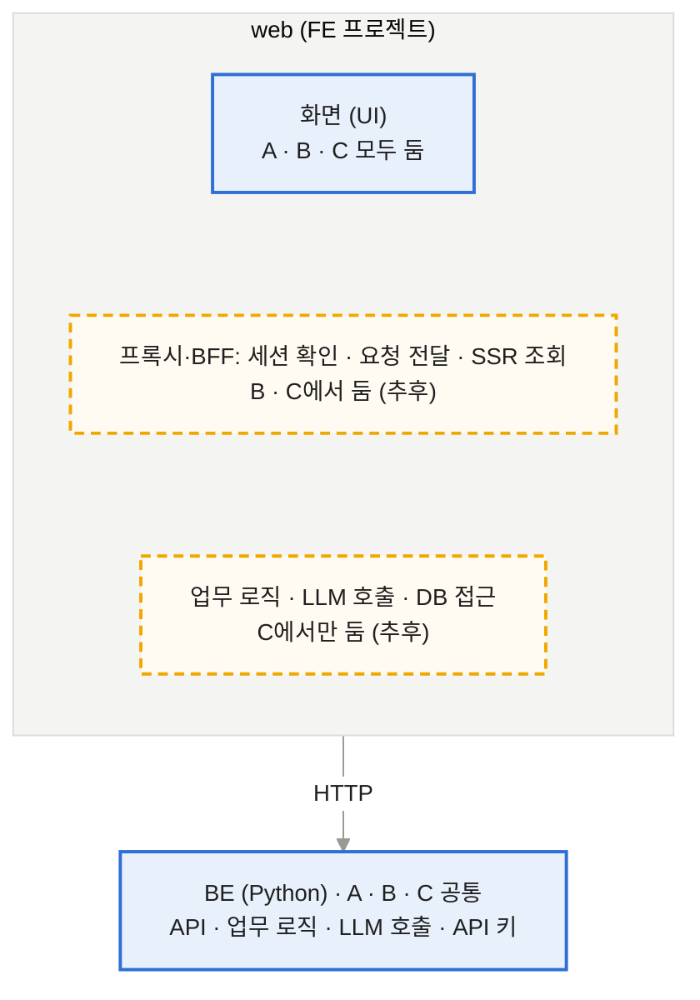
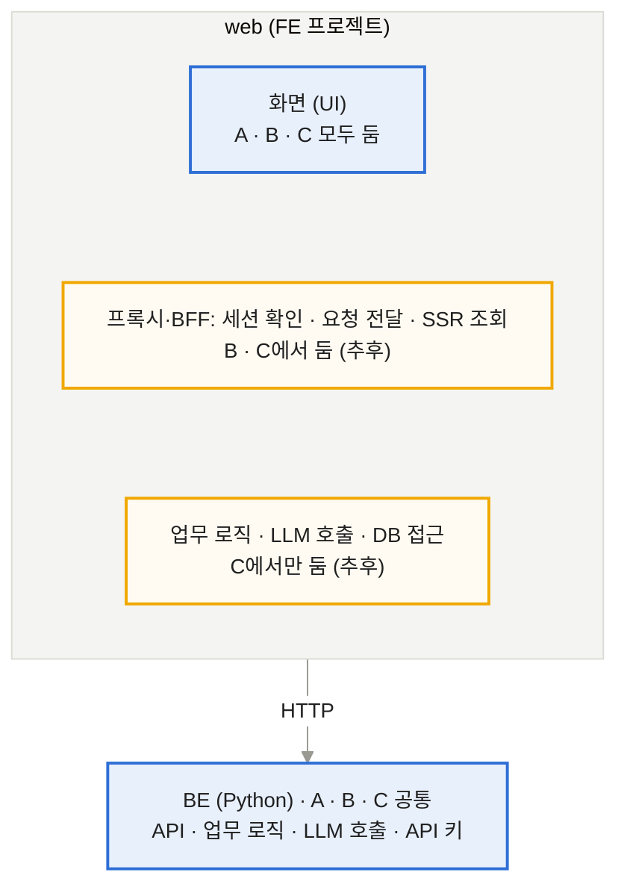
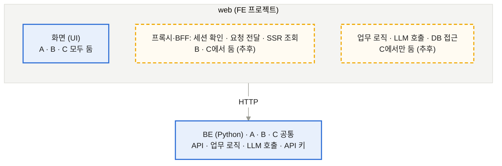
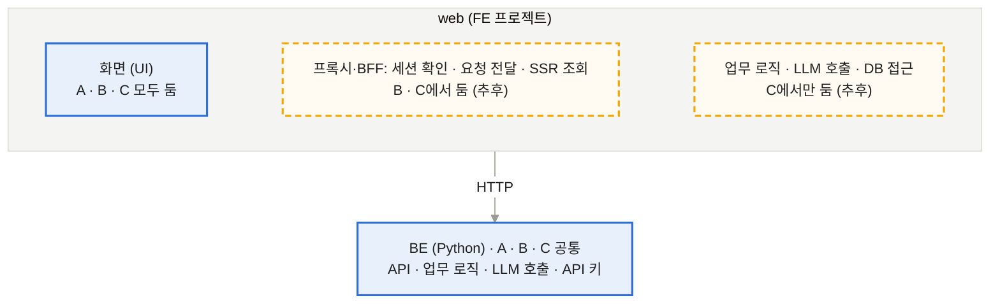
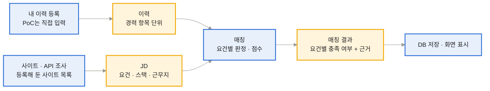

# test (삭제 예정)

## F1 FE as is

```mermaid
%%{init: {"theme": "base", "themeVariables": {"fontSize": "14px", "lineColor": "#9a9a92", "clusterBkg": "#f4f4f2", "clusterBorder": "#dcdcd6", "edgeLabelBackground": "#ffffff", "primaryTextColor": "#1f1f1f"}, "flowchart": {"wrappingWidth": 400}}}%%
flowchart TB
  subgraph WEB["web (FE 프로젝트)"]
    direction TB
    UI["화면 (UI)<br/>A · B · C 모두 둠"]:::done
    BFF["프록시·BFF: 세션 확인 · 요청 전달 · SSR 조회<br/>B · C에서 둠 (추후)"]:::later
    BIZ["업무 로직 · LLM 호출 · DB 접근<br/>C에서만 둠 (추후)"]:::later
    UI ~~~ BFF ~~~ BIZ
  end
  BE["BE (Python) · A · B · C 공통<br/>API · 업무 로직 · LLM 호출 · API 키"]:::done
  WEB -->|HTTP| BE

classDef done fill:#e8f0fc,stroke:#2f6fd6,stroke-width:2px,color:#1f1f1f
classDef todo fill:#fff4dc,stroke:#f0a800,stroke-width:2px,color:#1f1f1f
classDef later fill:#fffbf2,stroke:#f0a800,stroke-width:2px,stroke-dasharray:6 4,color:#1f1f1f
classDef ext fill:#ffffff,stroke:#b5b5ad,color:#1f1f1f
classDef code fill:#ececea,stroke:#d6d6d2,color:#1f1f1f
classDef fake fill:#ffffff,stroke:#b5b5ad,stroke-dasharray:5 4,color:#1f1f1f
classDef note fill:none,stroke:none,color:#555555
```

## F2 FE no dasharray

```mermaid
%%{init: {"theme": "base", "themeVariables": {"fontSize": "14px", "lineColor": "#9a9a92", "clusterBkg": "#f4f4f2", "clusterBorder": "#dcdcd6", "edgeLabelBackground": "#ffffff", "primaryTextColor": "#1f1f1f"}, "flowchart": {"wrappingWidth": 400}}}%%
flowchart TB
  subgraph WEB["web (FE 프로젝트)"]
    direction TB
    UI["화면 (UI)<br/>A · B · C 모두 둠"]:::done
    BFF["프록시·BFF: 세션 확인 · 요청 전달 · SSR 조회<br/>B · C에서 둠 (추후)"]:::later
    BIZ["업무 로직 · LLM 호출 · DB 접근<br/>C에서만 둠 (추후)"]:::later
    UI ~~~ BFF ~~~ BIZ
  end
  BE["BE (Python) · A · B · C 공통<br/>API · 업무 로직 · LLM 호출 · API 키"]:::done
  WEB -->|HTTP| BE

classDef done fill:#e8f0fc,stroke:#2f6fd6,stroke-width:2px,color:#1f1f1f
classDef todo fill:#fff4dc,stroke:#f0a800,stroke-width:2px,color:#1f1f1f
classDef later fill:#fffbf2,stroke:#f0a800,stroke-width:2px,color:#1f1f1f
classDef ext fill:#ffffff,stroke:#b5b5ad,color:#1f1f1f
classDef code fill:#ececea,stroke:#d6d6d2,color:#1f1f1f
classDef fake fill:#ffffff,stroke:#b5b5ad,color:#1f1f1f
classDef note fill:none,stroke:none,color:#555555
```

## F3 FE no invisible links

```mermaid
%%{init: {"theme": "base", "themeVariables": {"fontSize": "14px", "lineColor": "#9a9a92", "clusterBkg": "#f4f4f2", "clusterBorder": "#dcdcd6", "edgeLabelBackground": "#ffffff", "primaryTextColor": "#1f1f1f"}, "flowchart": {"wrappingWidth": 400}}}%%
flowchart TB
  subgraph WEB["web (FE 프로젝트)"]
    direction TB
    UI["화면 (UI)<br/>A · B · C 모두 둠"]:::done
    BFF["프록시·BFF: 세션 확인 · 요청 전달 · SSR 조회<br/>B · C에서 둠 (추후)"]:::later
    BIZ["업무 로직 · LLM 호출 · DB 접근<br/>C에서만 둠 (추후)"]:::later
  end
  BE["BE (Python) · A · B · C 공통<br/>API · 업무 로직 · LLM 호출 · API 키"]:::done
  WEB -->|HTTP| BE

classDef done fill:#e8f0fc,stroke:#2f6fd6,stroke-width:2px,color:#1f1f1f
classDef todo fill:#fff4dc,stroke:#f0a800,stroke-width:2px,color:#1f1f1f
classDef later fill:#fffbf2,stroke:#f0a800,stroke-width:2px,stroke-dasharray:6 4,color:#1f1f1f
classDef ext fill:#ffffff,stroke:#b5b5ad,color:#1f1f1f
classDef code fill:#ececea,stroke:#d6d6d2,color:#1f1f1f
classDef fake fill:#ffffff,stroke:#b5b5ad,stroke-dasharray:5 4,color:#1f1f1f
classDef note fill:none,stroke:none,color:#555555
```

## F4 FE no direction

```mermaid
%%{init: {"theme": "base", "themeVariables": {"fontSize": "14px", "lineColor": "#9a9a92", "clusterBkg": "#f4f4f2", "clusterBorder": "#dcdcd6", "edgeLabelBackground": "#ffffff", "primaryTextColor": "#1f1f1f"}, "flowchart": {"wrappingWidth": 400}}}%%
flowchart TB
  subgraph WEB["web (FE 프로젝트)"]
    UI["화면 (UI)<br/>A · B · C 모두 둠"]:::done
    BFF["프록시·BFF: 세션 확인 · 요청 전달 · SSR 조회<br/>B · C에서 둠 (추후)"]:::later
    BIZ["업무 로직 · LLM 호출 · DB 접근<br/>C에서만 둠 (추후)"]:::later
    UI ~~~ BFF ~~~ BIZ
  end
  BE["BE (Python) · A · B · C 공통<br/>API · 업무 로직 · LLM 호출 · API 키"]:::done
  WEB -->|HTTP| BE

classDef done fill:#e8f0fc,stroke:#2f6fd6,stroke-width:2px,color:#1f1f1f
classDef todo fill:#fff4dc,stroke:#f0a800,stroke-width:2px,color:#1f1f1f
classDef later fill:#fffbf2,stroke:#f0a800,stroke-width:2px,stroke-dasharray:6 4,color:#1f1f1f
classDef ext fill:#ffffff,stroke:#b5b5ad,color:#1f1f1f
classDef code fill:#ececea,stroke:#d6d6d2,color:#1f1f1f
classDef fake fill:#ffffff,stroke:#b5b5ad,stroke-dasharray:5 4,color:#1f1f1f
classDef note fill:none,stroke:none,color:#555555
```

## F5 README m3 as is

```mermaid
%%{init: {"theme": "base", "themeVariables": {"fontSize": "14px", "lineColor": "#9a9a92", "clusterBkg": "#f4f4f2", "clusterBorder": "#dcdcd6", "edgeLabelBackground": "#ffffff", "primaryTextColor": "#1f1f1f"}, "flowchart": {"wrappingWidth": 400}}}%%
flowchart LR
  REG["내 이력 등록<br/>PoC는 직접 입력"]:::done --> RES["이력<br/>경력 항목 단위"]:::todo --> MATCH["매칭<br/>요건별 판정 · 점수"]:::done
  SRC["사이트 · API 조사<br/>등록해 둔 사이트 목록"]:::done --> JD["JD<br/>요건 · 스택 · 근무지"]:::todo --> MATCH
  MATCH --> MR["매칭 결과<br/>요건별 충족 여부 + 근거"]:::todo --> OUT["DB 저장 · 화면 표시"]:::done

classDef done fill:#e8f0fc,stroke:#2f6fd6,stroke-width:2px,color:#1f1f1f
classDef todo fill:#fff4dc,stroke:#f0a800,stroke-width:2px,color:#1f1f1f
classDef later fill:#fffbf2,stroke:#f0a800,stroke-width:2px,stroke-dasharray:6 4,color:#1f1f1f
classDef ext fill:#ffffff,stroke:#b5b5ad,color:#1f1f1f
classDef code fill:#ececea,stroke:#d6d6d2,color:#1f1f1f
classDef fake fill:#ffffff,stroke:#b5b5ad,stroke-dasharray:5 4,color:#1f1f1f
classDef note fill:none,stroke:none,color:#555555
```

## F6 README m3 no dasharray

```mermaid
%%{init: {"theme": "base", "themeVariables": {"fontSize": "14px", "lineColor": "#9a9a92", "clusterBkg": "#f4f4f2", "clusterBorder": "#dcdcd6", "edgeLabelBackground": "#ffffff", "primaryTextColor": "#1f1f1f"}, "flowchart": {"wrappingWidth": 400}}}%%
flowchart LR
  REG["내 이력 등록<br/>PoC는 직접 입력"]:::done --> RES["이력<br/>경력 항목 단위"]:::todo --> MATCH["매칭<br/>요건별 판정 · 점수"]:::done
  SRC["사이트 · API 조사<br/>등록해 둔 사이트 목록"]:::done --> JD["JD<br/>요건 · 스택 · 근무지"]:::todo --> MATCH
  MATCH --> MR["매칭 결과<br/>요건별 충족 여부 + 근거"]:::todo --> OUT["DB 저장 · 화면 표시"]:::done

classDef done fill:#e8f0fc,stroke:#2f6fd6,stroke-width:2px,color:#1f1f1f
classDef todo fill:#fff4dc,stroke:#f0a800,stroke-width:2px,color:#1f1f1f
classDef later fill:#fffbf2,stroke:#f0a800,stroke-width:2px,color:#1f1f1f
classDef ext fill:#ffffff,stroke:#b5b5ad,color:#1f1f1f
classDef code fill:#ececea,stroke:#d6d6d2,color:#1f1f1f
classDef fake fill:#ffffff,stroke:#b5b5ad,color:#1f1f1f
classDef note fill:none,stroke:none,color:#555555
```
